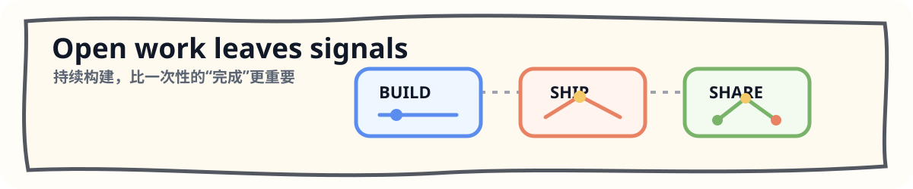

  

  <strong>一线全栈 & 大模型应用工程师 · 独立交易员 & 金融策略研究者</strong>

  公开一条从工程基础设施到 AI 应用落地的实践路线。

  <a href="https://anjing.cc">anjing.cc</a> ·
  <a href="#signals">Signals</a> ·
  <a href="#route">Route</a> ·
  <a href="#projects">Projects</a> ·
  <a href="#products">Products</a>

---

## Signals

  

<table>
  <tr>
    <td width="50%">
      
    </td>
    <td width="50%">
      
    </td>
  </tr>
</table>

---

## Route

  

---

## Projects

### Infra

<table>
  <tr>
    <td width="50%"></td>
    <td width="50%"></td>
  </tr>
</table>

### Agent Projects

<table>
  <tr>
    <td width="50%"></td>
    <td width="50%"></td>
  </tr>
  <tr>
    <td width="50%"></td>
    <td width="50%" valign="top">
      <strong>Teaching Notes</strong> 
      每个项目都服务于一个上下文工程主题：调度、检索、兜底、治理和可复制交付。
    </td>
  </tr>
</table>

---

## Products

| Product | Direction |
| --- | --- |
| **anjing-anjing** | 个人 AI 桌面助手，12 条成长赛道的统一入口 |
| **anjing-aigc** | AIGC 图文创作服务，面向小红书等内容平台 |
| **anjing-richfree** | 财富自由工具平台，AI + 投资监控 |
