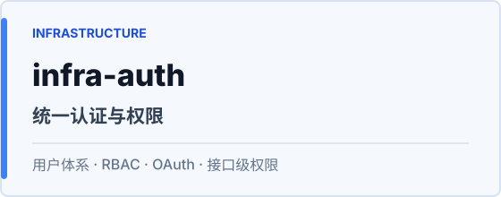
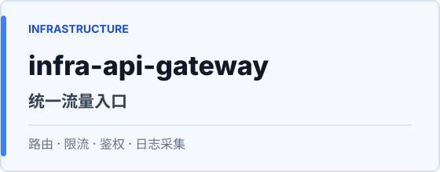
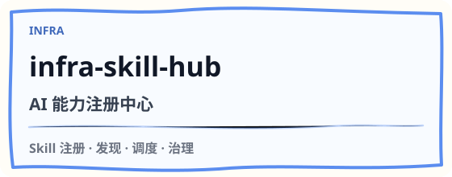

  

  <strong>一线全栈 & 大模型应用工程师 · 独立交易员 & 金融策略研究者</strong>

  把 AI 产品、工程基础设施和内容作品做成可运行、可复用、可长期迭代的系统。

  <a href="https://anjing.cc">anjing.cc</a> ·
  <a href="#open-source">Open Source</a> ·
  <a href="#products">Products</a> ·
  <a href="#principles">Principles</a>

---

## About

- 我在公开一条从工程基础设施到 AI 应用落地的实践路线。
- 开源代码本身不是要售卖的商品，更像持续迭代的作品集、学习路线和能力证明。
- 未来如果提供个人服务，会更偏向定制化落地、工程共创、策略咨询和长期支持。

  

---

## Focus

<table>
  <tr>
    <td width="33%" valign="top">
      <strong>AI Applications</strong> 
      Agent、RAG、多模型调度和 Prompt 工作流，从 demo 走到可交付产品。
    </td>
    <td width="33%" valign="top">
      <strong>Engineering Infra</strong> 
      可复制的全栈母版、统一权限、API 网关、LLM 网关和 Skill 注册中心。
    </td>
    <td width="33%" valign="top">
      <strong>Creator Systems</strong> 
      把技术、内容、审美和商业判断组合成可持续的个人产品体系。
    </td>
  </tr>
</table>

---

## Open Source

公开项目分成两条线：一条沉淀可复用的工程底座，一条拆解 AI 应用开发的完整路径。代码本身保持开源，它们更像一条从基础设施到 AI 应用的实践路线；未来如果提供服务，也会围绕个人经验、定制化落地和长期支持展开。

### Infra

<table>
  <tr>
    <td width="50%"></td>
    <td width="50%"></td>
  </tr>
  <tr>
    <td width="50%"></td>
    <td width="50%"></td>
  </tr>
  <tr>
    <td width="50%"></td>
    <td width="50%" valign="top">
      <strong>Infra Roadmap</strong> 
      这些项目负责把常见工程能力抽出来：启动项目、接用户体系、接流量入口、接模型能力、接 Skill 调度。
    </td>
  </tr>
</table>

### Agent Projects

<table>
  <tr>
    <td width="50%"></td>
    <td width="50%"></td>
  </tr>
  <tr>
    <td width="50%"></td>
    <td width="50%" valign="top">
      <strong>Teaching Notes</strong> 
      每个项目都服务于一个上下文工程主题：调度、检索、兜底、治理和可复制交付。
    </td>
  </tr>
</table>

---

## Products

这些项目不全部开源，但会长期迭代。

| Product | Direction |
| --- | --- |
| **anjing-anjing** | 个人 AI 桌面助手，12 条成长赛道的统一入口 |
| **anjing-aigc** | AIGC 图文创作服务，面向小红书等内容平台 |
| **anjing-richfree** | 财富自由工具平台，AI + 投资监控 |

---

## Principles

- 先跑通，再打磨体验；先定义边界，再写复杂逻辑。
- 不堆概念，沉淀可以复制、可以教学、可以运营的系统。
- 内容不是包装，是让项目被理解、被使用、被传播的接口。

  
GitHub signals

   

  <table>
    <tr>
      <td>
        
      </td>
      <td>
        
      </td>
    </tr>
  </table>

