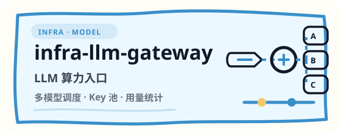
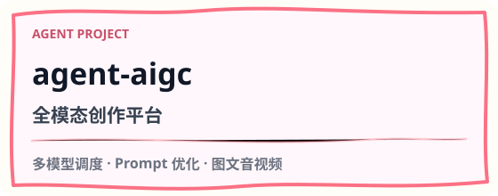
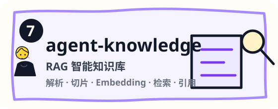
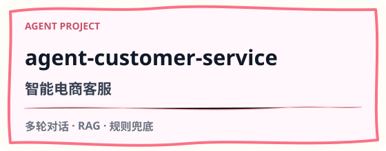

  

  <strong>AI 应用基础设施 · Agent 工程 · 产品化实验</strong> 
  从 <strong>工程脚手架</strong>、<strong>网关与权限</strong>、<strong>模型接入</strong> 到 <strong>Agent / 知识库 / 内容生产</strong>。 
  这里沉淀可运行、可复用、可持续迭代的开源项目，把一线实践整理成清晰的工程路线。

  <a href="https://anjing.cc">anjing.cc</a> ·
  <a href="#signals">Signals</a> ·
  <a href="#route">Route</a> ·
  <a href="#projects">Projects</a> ·
  <a href="#products">Products</a>

---

## Signals

<table>
  <tr>
    <td width="50%">
      
    </td>
    <td width="50%">
      
    </td>
  </tr>
</table>

---

## Route

  

---

## Projects

### Infra

<table>
  <tr>
    <td width="50%"></td>
    <td width="50%"></td>
  </tr>
</table>

### Agent Projects

<table>
  <tr>
    <td width="50%"></td>
    <td width="50%"></td>
  </tr>
  <tr>
    <td width="50%"></td>
    <td width="50%"></td>
  </tr>
</table>

### Creator Tools

<table>
  <tr>
    <td width="50%"></td>
    <td width="50%"></td>
  </tr>
</table>

---

## Products

  

| Product | Direction |
| --- | --- |
| **anjing-anjing** | 个人 AI 桌面助手，12 条成长赛道的统一入口 |
| **anjing-aigc** | AIGC 图文创作服务，面向小红书等内容平台 |
| **anjing-richfree** | 财富自由工具平台，AI + 投资监控 |
